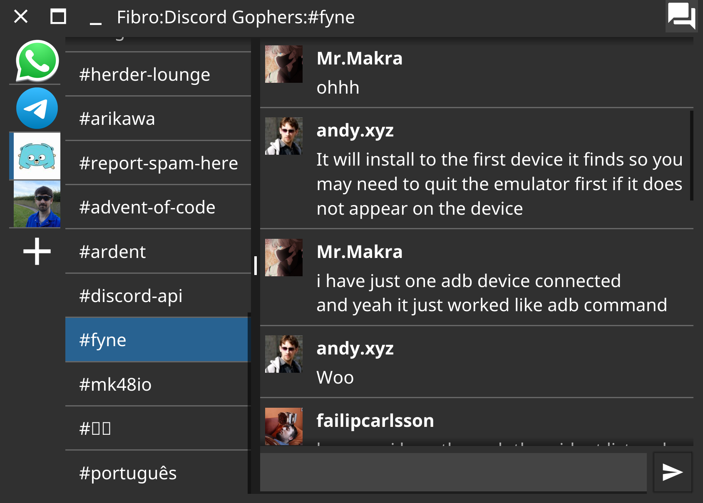

# Fibro

Really early days proof of concept for a cross-platform multi-server chat.
Feel free to play, but don't expect it to do much!

## Features

- [x] Discord login & MFA
- [x] Switch servers and channels
- [x] Load recent and new messages

*Urgent*

- [ ] Faster startup (download messages after app shows)
- [ ] Wrap message content and fix layout
- [ ] Add support for multiple server types

*Planned*

- [ ] Send messages
- [ ] Rich text content (requires Fyne 2.1)
- [ ] Emojis
- [ ] Slack accounts
- [ ] Matrix accounts
- [ ] IRC accounts

